# The Night at the Museum

This project is part of [Udacity](https://www.udacity.com "Udacity - Be in demand")'s [VR Developer Nanodegree](https://www.udacity.com/course/vr-developer-nanodegree--nd017).

## Versions
- Unity 2017.1.0p4
- GVR Unity SDK v1.70.0

## Instructions

Contains large files. Install git-lfs
- https://github.com/git-lfs/git-lfs
- https://git-lfs.github.com/

## Files

Scene:
- Museum/Assets/UdacityVR/Scenes/Museum.unity

Video:
- Museum.mov

# My Night at the Museum Project

After the Puzzler which I created as part of my coursework with Udacity I
created a new mobile VR experience named the Night at the Museum. This time the
viewer can encounter research on the theme of virtual reality in a virtual
museum.

## Introduction

The scene of the museum is set up in a virtual dome connecting past with the
future. In order to experience the past viewer can onboard the tall ship. Red
and green tones were used as the basic colors of the museum and represent the
navigational lights found in ships and aviation. There is a futuristic
spaceship in the museum which might be used one day to explore our galaxy Milky
Way which is projected on the dome.

The theme in the museum is Virtual Reality. There are five boots showing the
evolution of VR.

Check out [the video](https://youtu.be/YyHNnggyKF4).

## Story of the process

First I sketched the idea. The museum should be at the intersection of three
infinite lanes. The viewer enters the museum through the big gate.

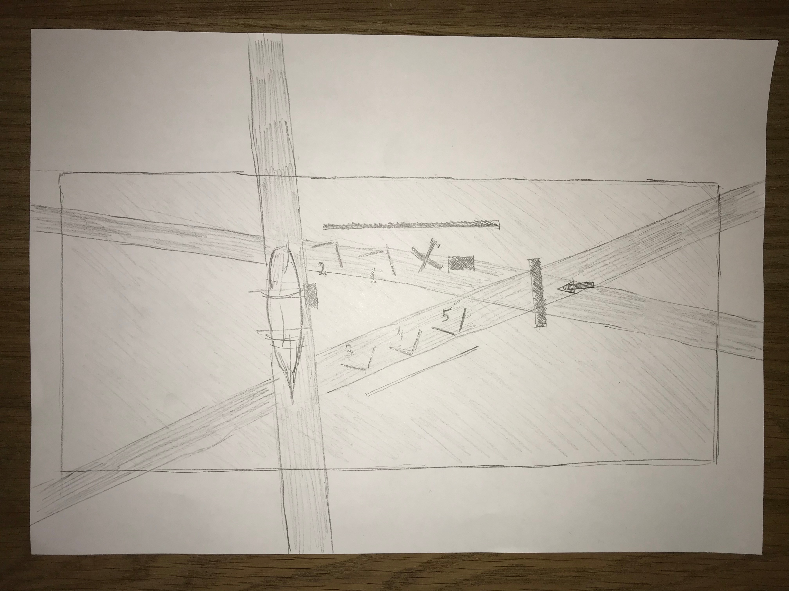
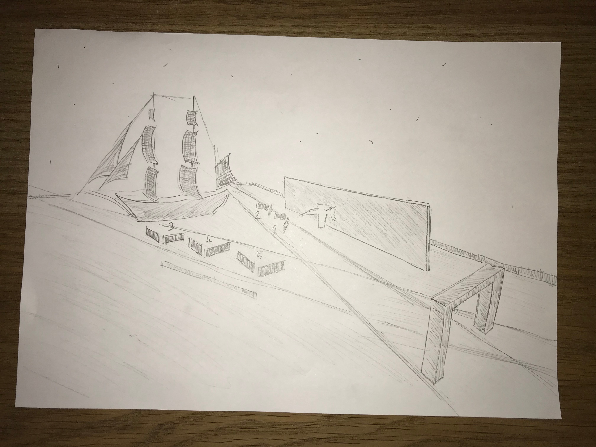

I set up the tall-ship and the spaceship.

### User testing outcomes and iteration

#### Feedback 1: Its very hard to read

The text on the display panels was hard to read using the VR headset. Once I
increased the font size and make it bold it was better.

#### Feedback 2: Videos are not playing

During the work on the museum, I found videos jerky in Unity on the Mac. I
converted them to OGV format and that solved the issue on Mac. But once I
deployed the project to iPhone videos didn’t show up. I find out that videos in
MP4 format are working on iOS so I used those.

# Breakdown of final piece

Most of the content shown in the museum is from the [virtual](https://en.wikipedia.org/wiki/Virtual_reality)
and [augmented](https://en.wikipedia.org/wiki/Augmented_reality)
reality wiki web pages.

I used Unity canvas and text element to create the basic booth panel. On some
of the panels that contained a lot of text, I used narration. I converted text
to audio using from text to speech and played audio on GVR audio source placed
behind the panel.

In order to display the images I used raw image component.

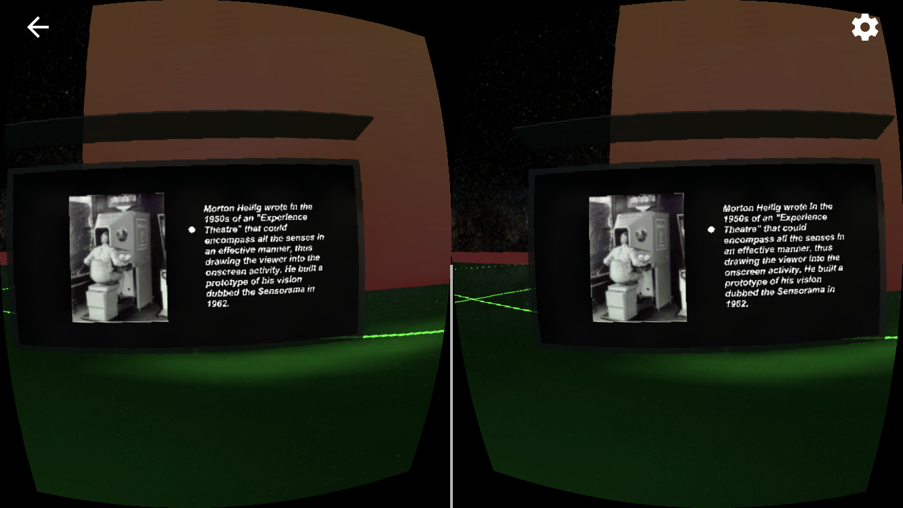

I found a couple of really good and inspiring videos on TED on the theme of
virtual and augmented reality (
[Alex
Kipman](https://www.ted.com/talks/alex_kipman_the_dawn_of_the_age_of_holograms),
[Chris
Milk](https://www.ted.com/talks/chris_milk_the_birth_of_virtual_reality_as_an_art_form),
[Meron
Gribetz](https://www.ted.com/talks/meron_gribetz_a_glimpse_of_the_future_through_an_augmented_reality_headset)
). I
downloaded the videos and extracted audio using filezigzag converter.

In order to display the video, I used standard Unity video player component. At
first, videos looked very dark but once I set the material property to emission
map they started to look very natural and cool.

Extracted audio is linked with GVR audio source and placed behind the screen
and gives very nice spacial audio effect.

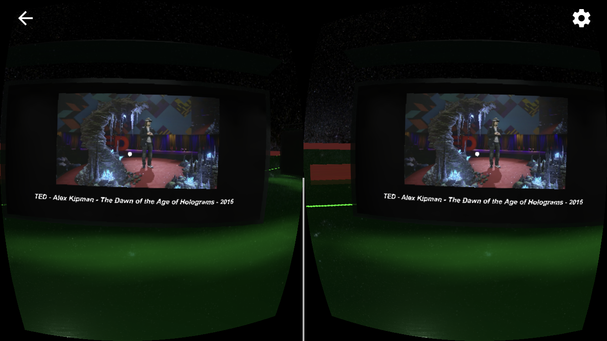

Some cool pictures from the museum...

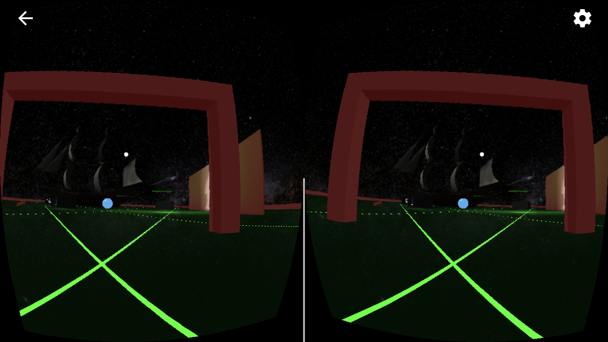
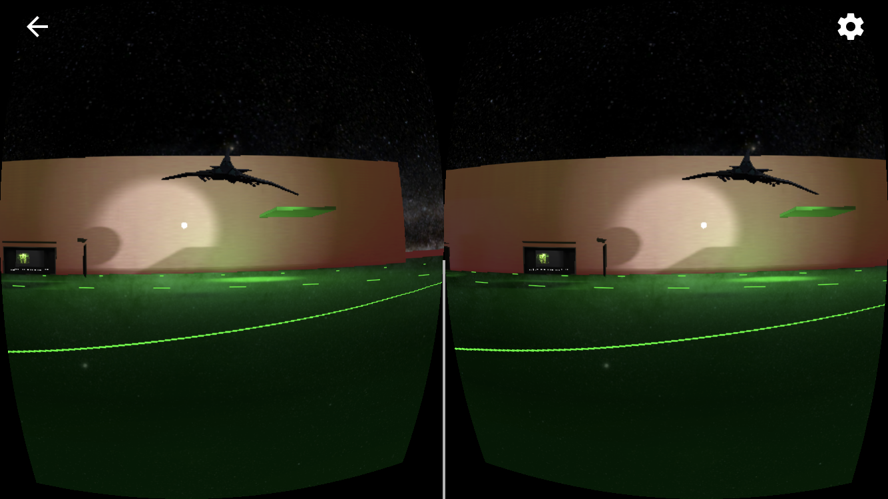

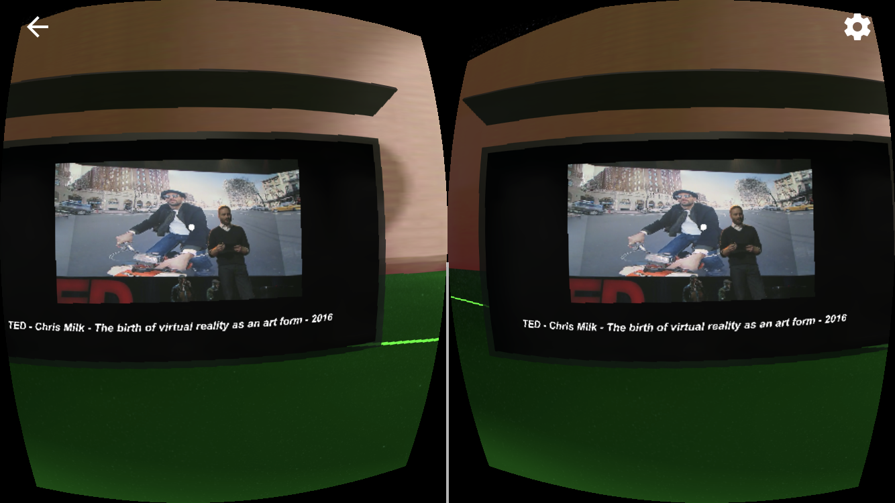
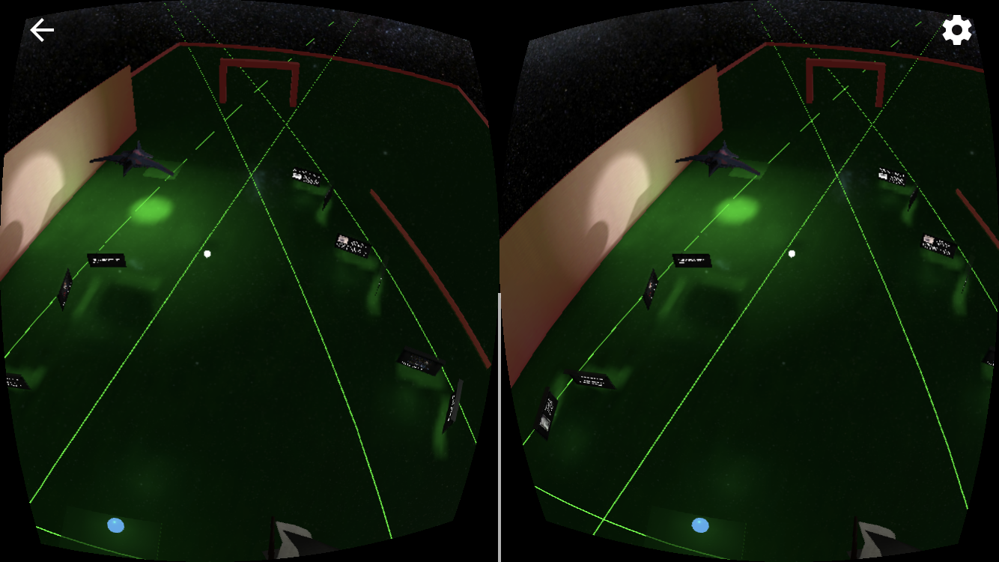
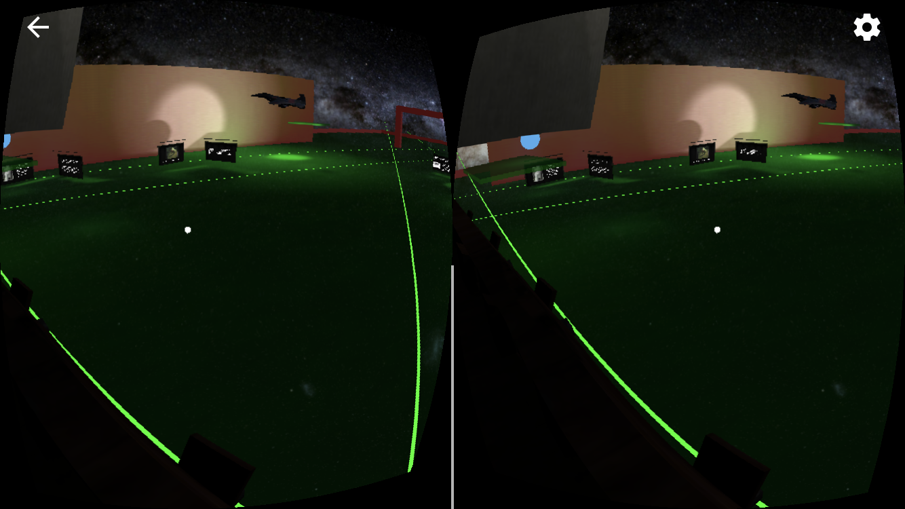
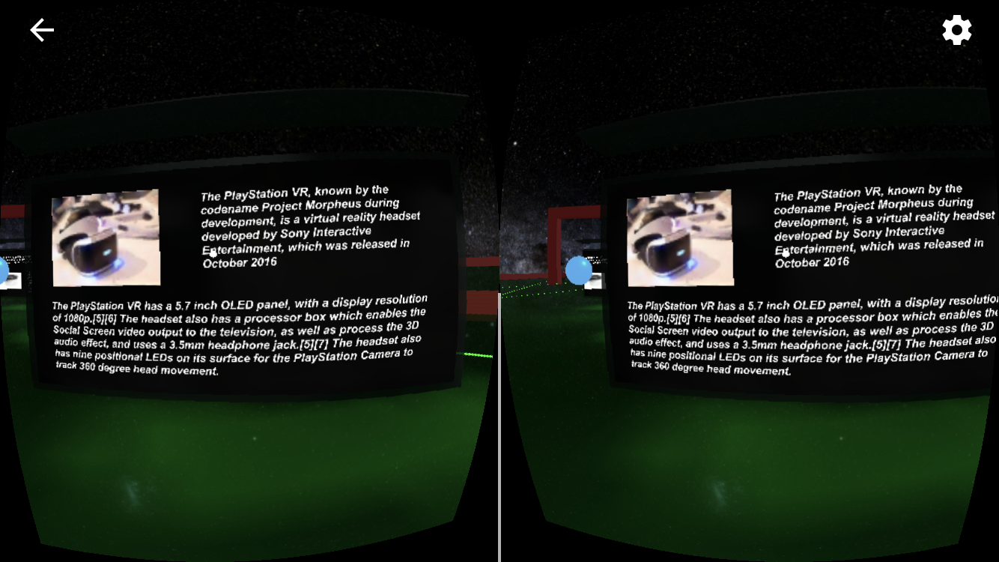
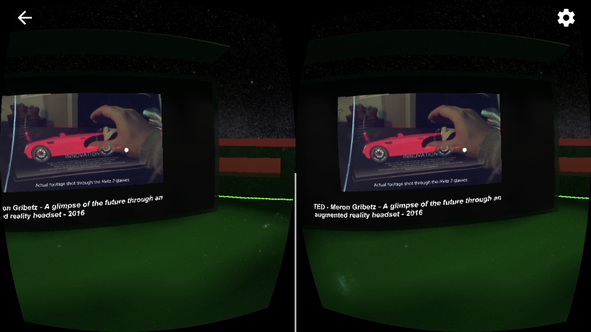
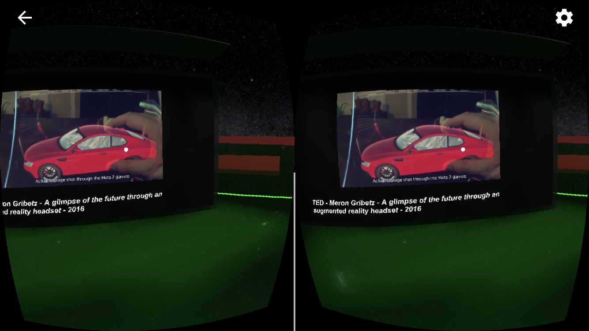
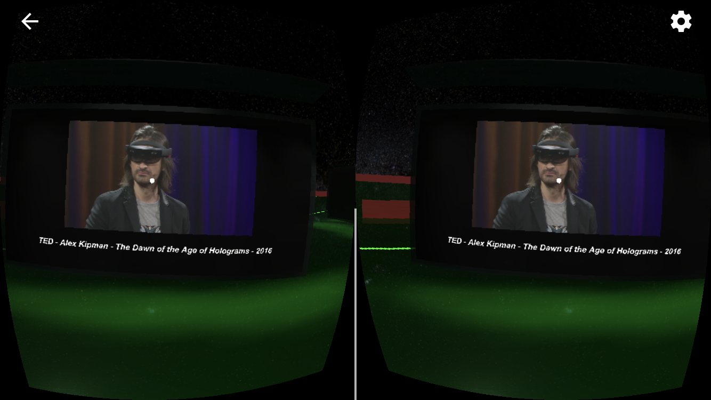
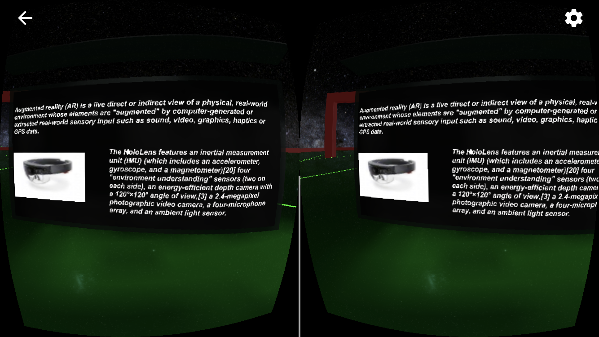

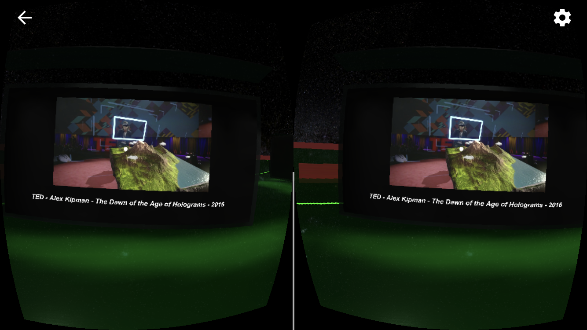
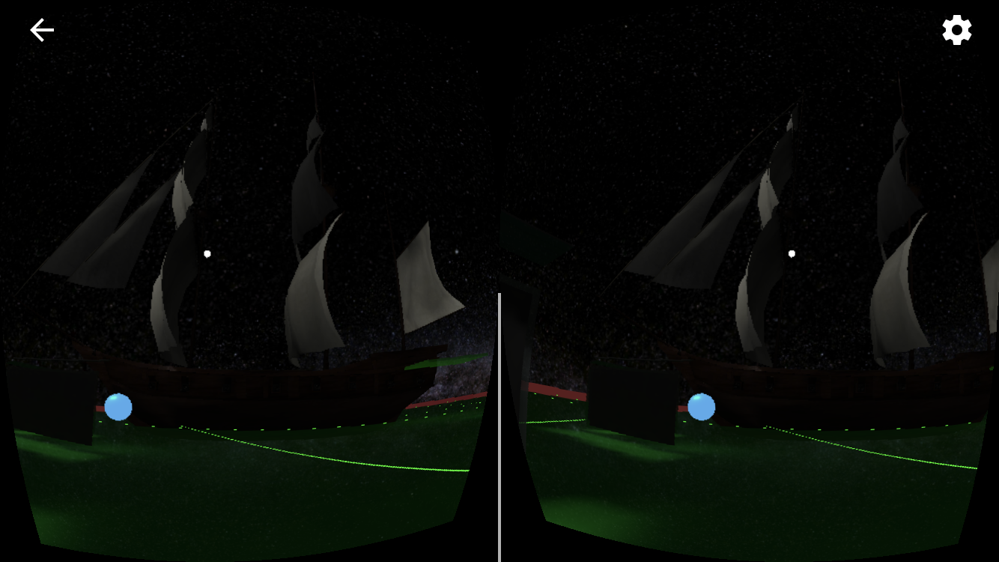

## Conclusion

This project concludes the second term of the Udacity VR nanodegree. I really
enjoyed working on it but I’m also looking forward to the last third term where
we’ll explore total VR immersion with 6 degrees of freedom headsets. I just
have to figure out should I work with HTC Vive or Oculus Rift :-)

### Next Steps

The narration fade out script could be improved to focus only only on the
selected text and fade out all other audio, swaying of the tall ship could be
added and potentially the control panel where user could choose different
images to be projected on the dome (skybox) could be added.

### Link to additional work

[Puzzler](https://medium.com/@miha_43105/my-puzzler-project-1fa507190251)
