# The Night at the Museum

This project is part of [Udacity](https://www.udacity.com "Udacity - Be in demand")'s [VR Developer Nanodegree](https://www.udacity.com/course/vr-developer-nanodegree--nd017).

## Versions
- Unity 2017.1.0p4
- GVR Unity SDK v1.70.0

## Instructions

Contains large files. Install git-lfs
- https://github.com/git-lfs/git-lfs
- https://git-lfs.github.com/

## Files

Scene:
- Project/Assets/UdacityVR/Scenes/Museum

Video:

## Images

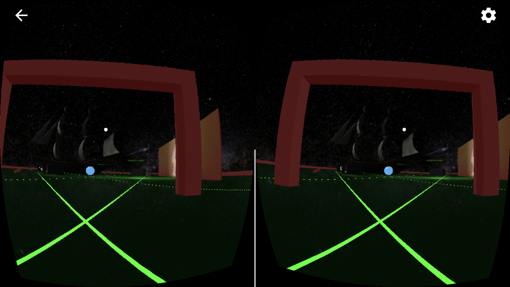
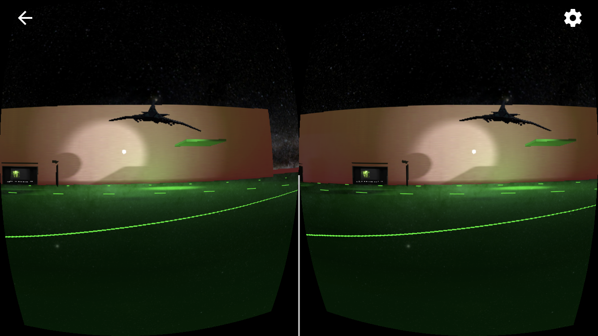
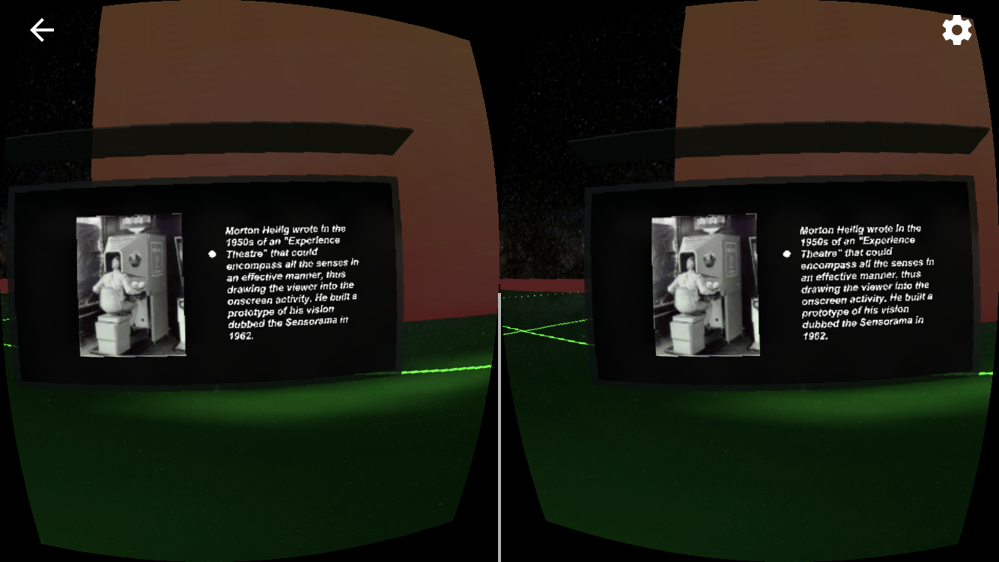
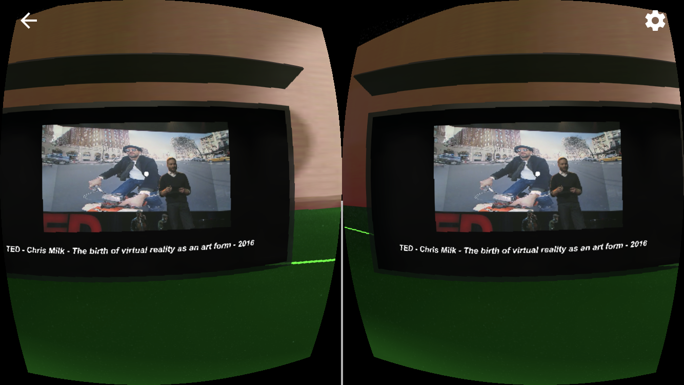
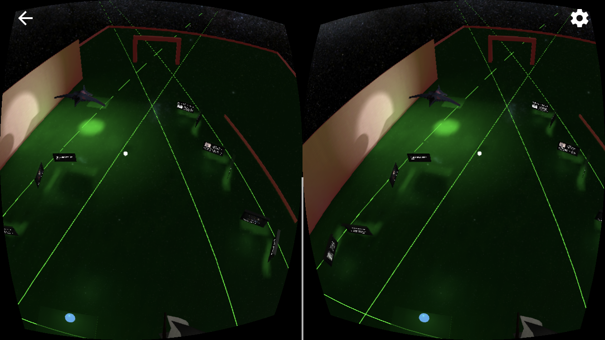
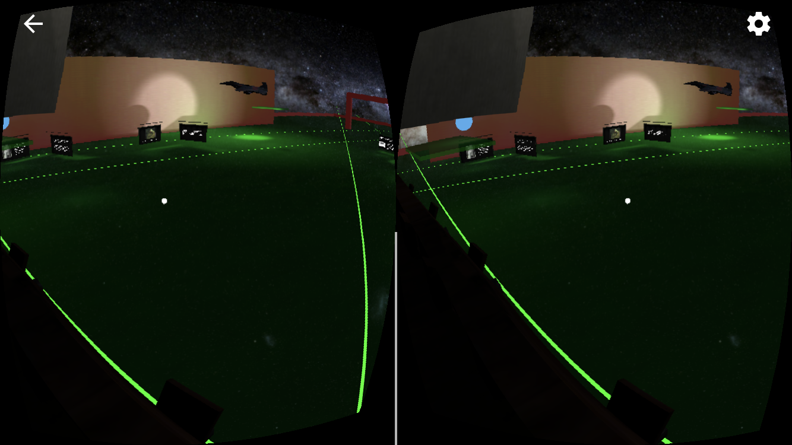
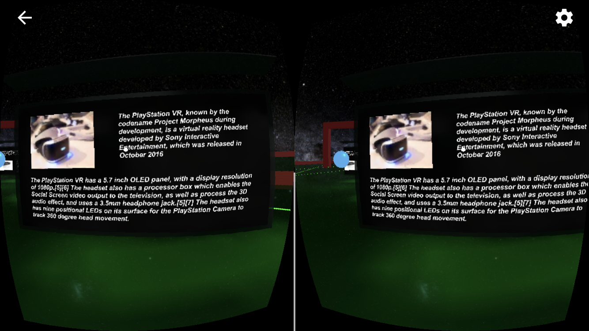
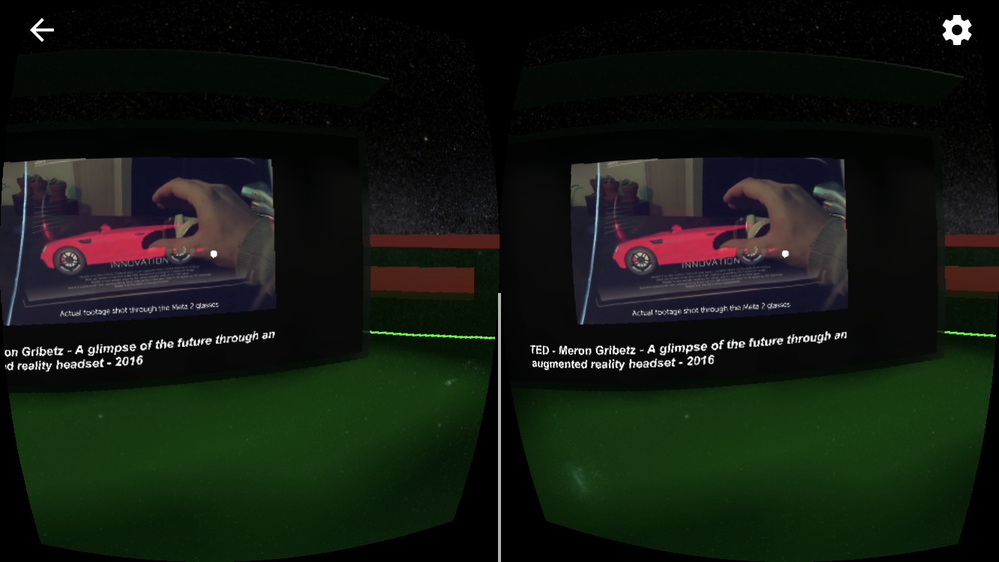
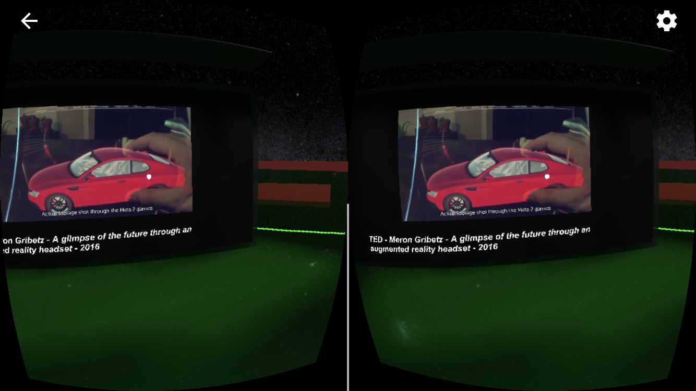
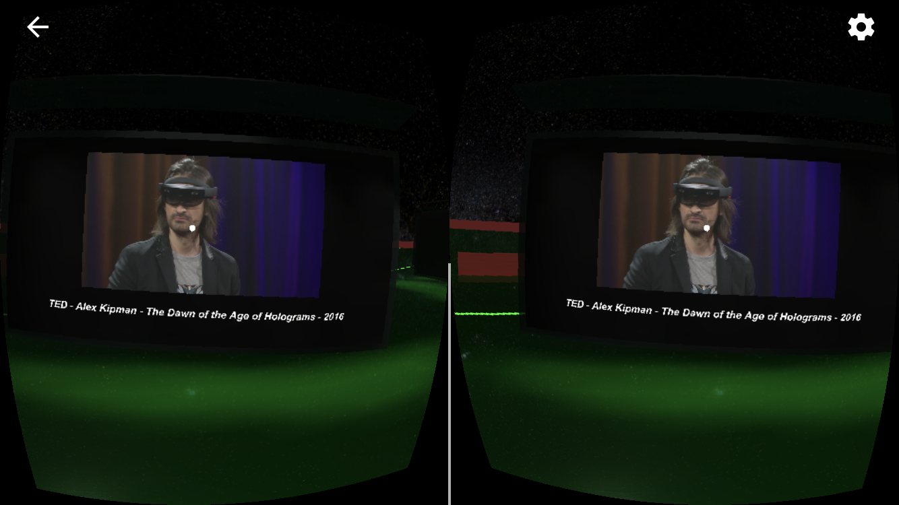
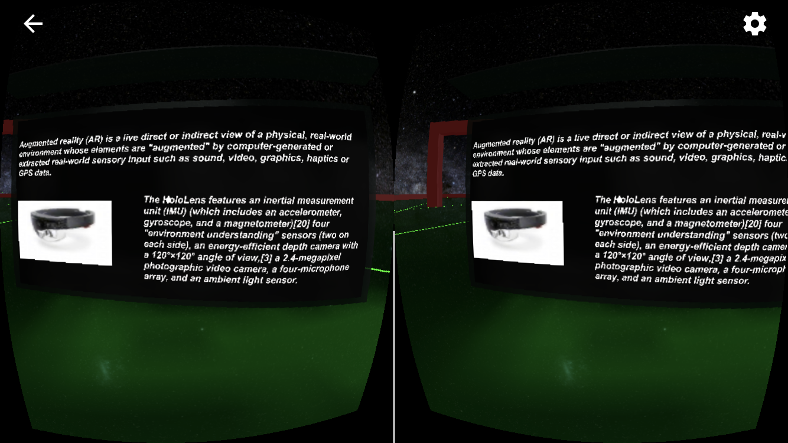
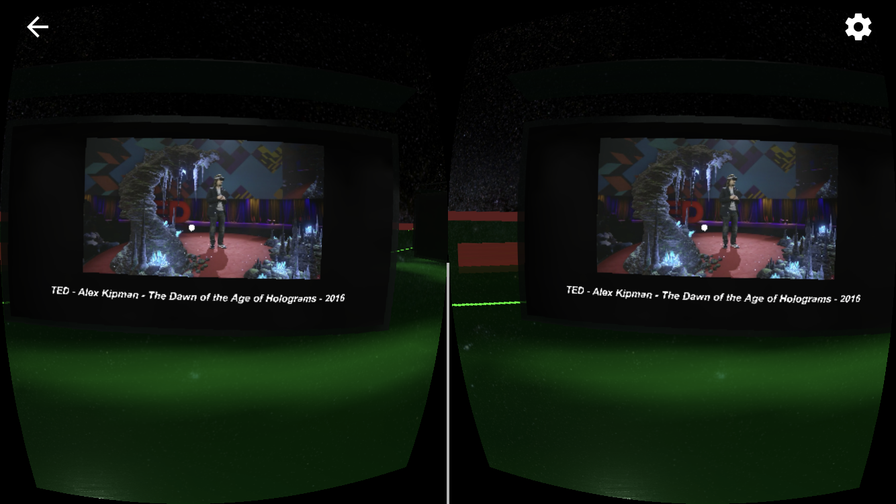
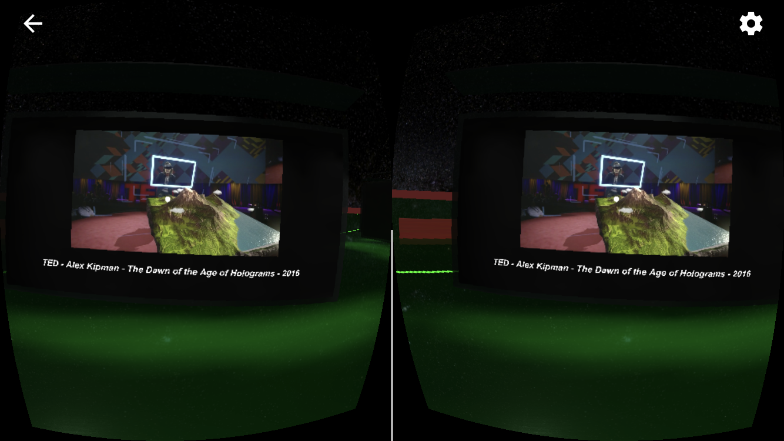
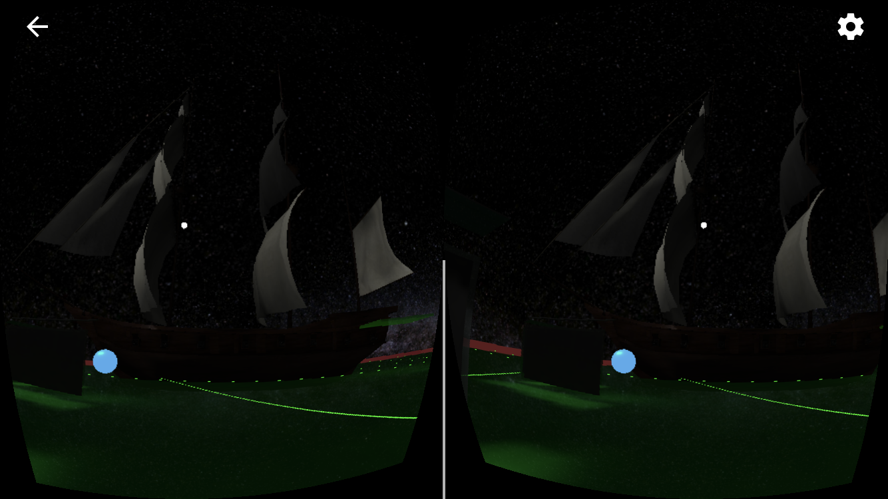

